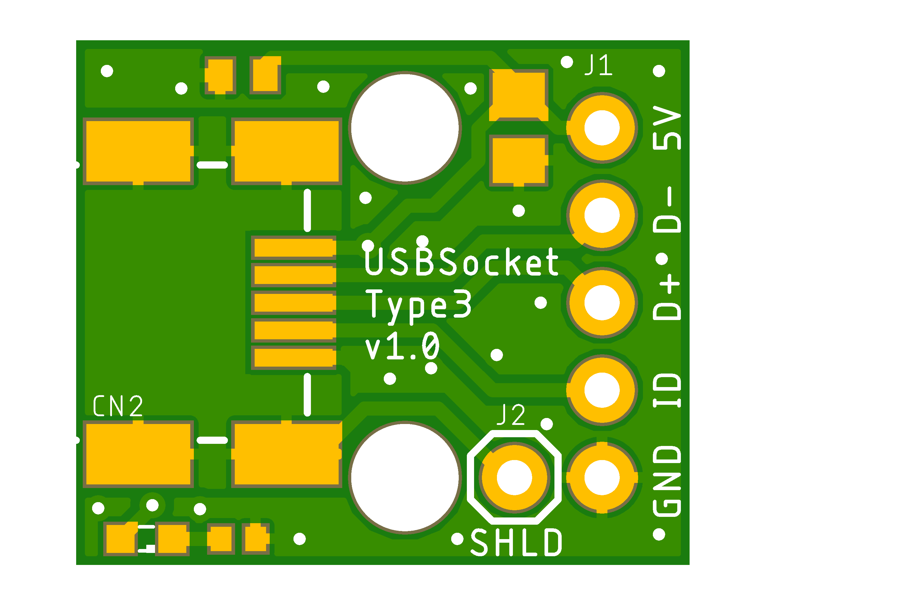
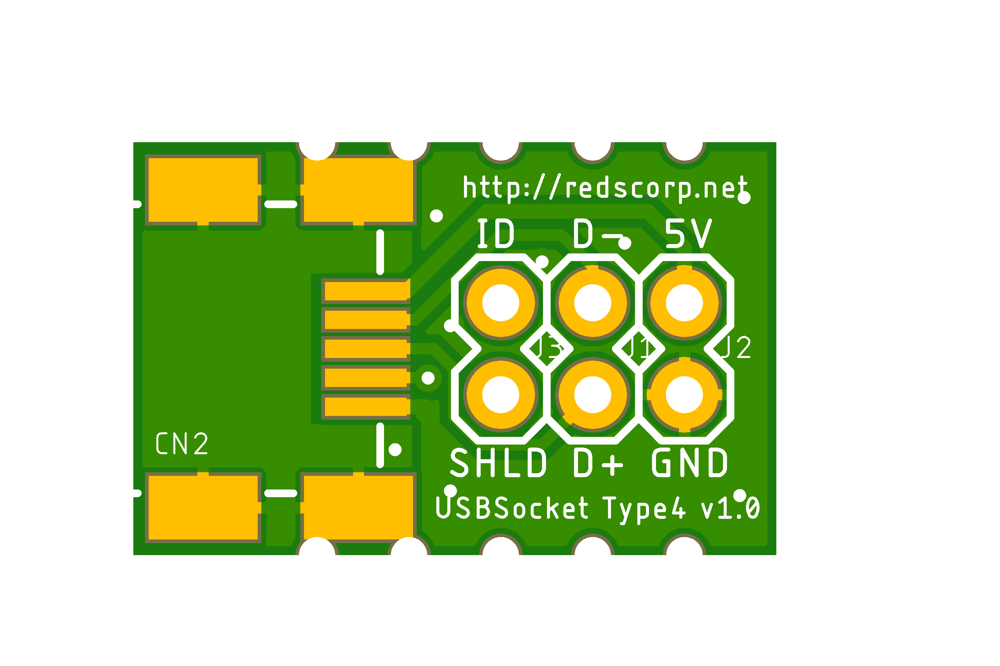
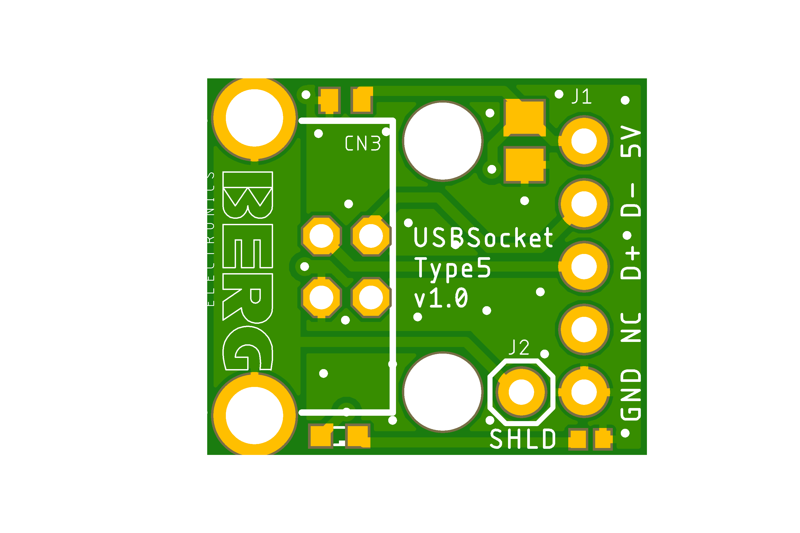
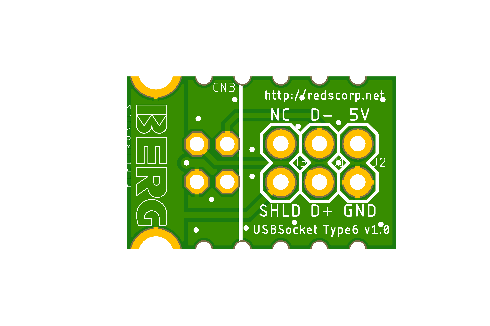
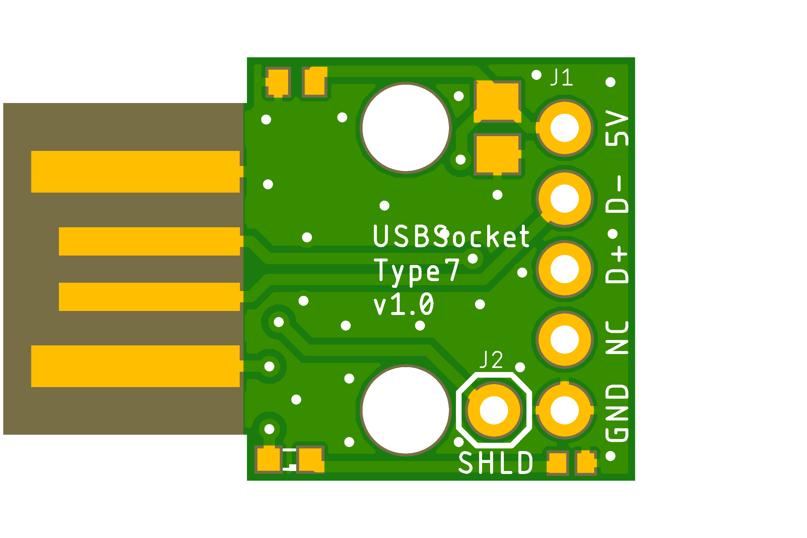

# USBSocket project

USB Socket board came into existence as alternative to cheap miniUSB adapters which we not good enough for me.
These cheap boards do not care about D+/D- traced being equally long which is essential for USB wiring.
I had to design my own microUSB adapter board to fit my needs.

Following types of boards are available:

- **Type1** is breadboard friendly **microUSB** socket
- **Type2** is cable mount friendly **microUSB** socket
- **Type3** is breadboard friendly **miniUSB** socket
- **Type4** is cable mount friendly **miniUSB** socket
- **Type5** is breadboard friendly **USB** socket
- **Type6** is cable mount friendly **USB** socket

## USBSocket_Type1_v1.0

**USBSocket_Type1_v1.0** is a simple microUSB adapter board, which mostly designed to be breadboard friendly.

Preview:

[Schematics in PDF format](USBSocket_Type1_v1.0.pdf)

Features:

- 2.54mm (0.1") raster breadboard friendly
- small size
- includes decoupling capacitor
- includes power LED indicator
- 3mm mount holes

CAM files are available.

## USBSocket_Type2_v1.0

**USBSocket_Type2_v1.0** is a simple microUSB adapter board mostly usable for smaller or cable applications.

Preview:

[Schematics in PDF format](USBSocket_Type2_v1.0.pdf)

Features:

- 2.54mm (0.1") raster board friendly
- even smaller size
- suitable for cable mount
- shrink-tube friendly

CAM files are available.

## USBSocket_Type3_v1.0

**USBSocket_Type3_v1.0** is a simple miniUSB adapter board, which mostly designed to be breadboard friendly.

Preview:

[Schematics in PDF format](USBSocket_Type3_v1.0.pdf)

Features:

- 2.54mm (0.1") raster breadboard friendly
- small size
- includes decoupling capacitor
- includes power LED indicator
- 3mm mount holes

CAM files are available.

## USBSocket_Type4_v1.0

**USBSocket_Type4_v1.0** is a simple miniUSB adapter board mostly usable for smaller or cable applications.

Preview:

[Schematics in PDF format](USBSocket_Type4_v1.0.pdf)

Features:

- 2.54mm (0.1") raster board friendly
- even smaller size
- suitable for cable mount
- shrink-tube friendly

CAM files are available.

## USBSocket_Type5_v1.0

**USBSocket_Type5_v1.0** is a simple USB adapter board, which mostly designed to be breadboard friendly.

Preview:

[Schematics in PDF format](USBSocket_Type5_v1.0.pdf)

Features:

- 2.54mm (0.1") raster breadboard friendly
- small size
- includes decoupling capacitor
- includes power LED indicator
- 3mm mount holes

CAM files are available.

## USBSocket_Type6_v1.0

**USBSocket_Type6_v1.0** is a simple USB adapter board mostly usable for smaller or cable applications.

Preview:

[Schematics in PDF format](USBSocket_Type6_v1.0.pdf)

Features:

- 2.54mm (0.1") raster board friendly
- even smaller size
- suitable for cable mount
- shrink-tube friendly

CAM files are available.

## USBSocket_Type7_v1.0

**USBSocket_Type7_v1.0** is a simple PCB-USB adapter board, which mostly designed to be breadboard friendly.
This PCB board should be 2.0mm thick!

Preview:

[Schematics in PDF format](USBSocket_Type7_v1.0.pdf)

Features:

- 2.54mm (0.1") raster breadboard friendly
- small size
- includes decoupling capacitor
- includes power LED indicator
- 3mm mount holes

CAM files are available.

## USBSocket_Type8_v1.0

**USBSocket_Type8_v1.0** is a simple PCB-USB adapter board mostly usable for smaller or cable applications.
This PCB board should be 2.0mm thick!

Preview:

[Schematics in PDF format](USBSocket_Type8_v1.0.pdf)

Features:

- 2.54mm (0.1") raster board friendly
- even smaller size
- suitable for cable mount
- shrink-tube friendly

CAM files are available.

## BOM

Bill Of Materials is currently available only for LCSC Electronic Components Distributor, which is probably cheapest anyway.

### LCSC BOM

|Designator  |Part/Value      |Package/Footprint    |LCSC #  |
|------------|----------------|---------------------|--------|
|CN1         |MOLEX 473460001 |SMD                  |C132560 |
|CN2         |MOLEX 675031230 |SMD                  |C136452 |
|CN3         |MOLEX 670688000 |TH                   |C114097 |
|C1\*        |Cap. 47uF       |0805                 |C109461 |
|C2\*        |Cap. 100nF      |0402                 |C60474  |
|LED1\*      |LED Green       |0603                 |C364559 |
|R1\*        |Res. 1K         |0402                 |C384390 |

\*) These passive components are optional but it's recommended to install them.

## How to help

Your contributions as code, resources or finances are welcome!
Please contact me directly over e-mail andriy.golovnya@gmail.com or over [GitHub profile](https://github.com/red-scorp).
Link for [Paypal donations](http://paypal.me/redscorp), which are always welcome.
Thanks in advance!
